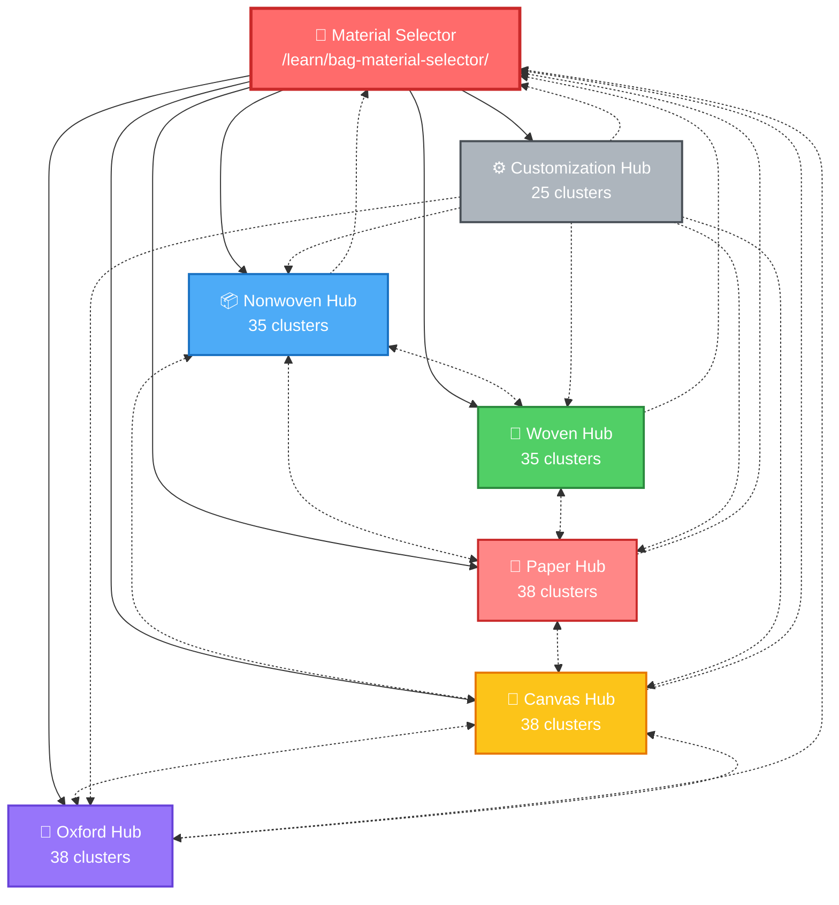
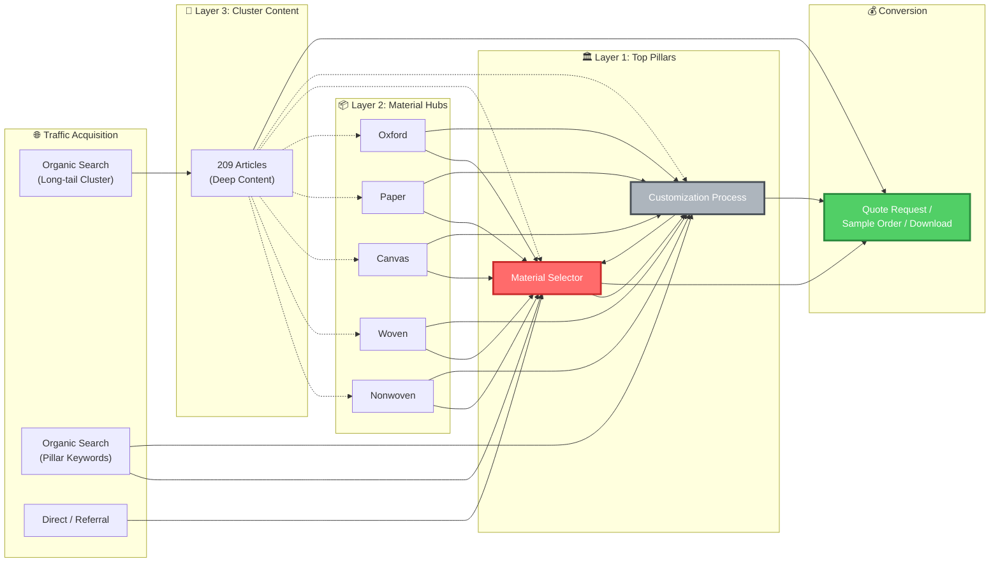

# Internal Linking Visual Map

> 本文件使用 Mermaid 语法绘制内链网络图谱。可在支持 Mermaid 的 Markdown 编辑器（如 Typora、Obsidian、GitHub）中渲染查看。  
> 每个图谱中的 **实线箭头** 表示主要内链方向，**虚线箭头** 表示跨板块 / 跨层级链接，**双向箭头** 表示双向互链。

---

## 图 1：顶层 Hub & Spoke 架构总览



**图注：** 红色中心节点为顶层决策页，所有材质板块均向其回链。灰色通用板块向下链接至全部 5 个材质 Hub。虚线双向箭头表示跨材质对比文章建立的横向连接。

---

## 图 2：Nonwoven 板块内链网络

```mermaid
flowchart TD
    subgraph Nonwoven["📦 Nonwoven Hub & Spoke"]
        direction TB
        HUB["🏛️ Nonwoven Complete Guide<br/>(Pillar)"]

        subgraph Basics["🔬 Material Basics"]
            N1["Nonwoven 101"]
            N2["PP Spunbond"]
            N3["Needle-Punched"]
            N4["Spunlace"]
            N5["Thermal-Bonded"]
            N6["Laminated vs Standard"]
            N7["Biodegradable PLA"]
        end

        subgraph GSM["⚖️ Weight & Performance"]
            N8["GSM Guide"]
            N9["GSM vs Load"]
            N10["Thickness & Hand Feel"]
            N12["Tear Strength"]
        end

        subgraph Print["🎨 Printing Methods"]
            N13["Screen Printing"]
            N14["Heat Transfer"]
            N15["Laminated CMYK"]
            N11["Custom Colors"]
        end

        subgraph Construction["🔧 Construction"]
            N16["Ultrasonic vs Sewing"]
            N17["Stitching Specs"]
            N18["Handle Designs"]
            N20["Box vs Flat"]
        end

        subgraph Application["🛍️ Applications"]
            N21["Shopping Bags"]
            N22["Trade Show Bags"]
            N23["Gift Bags"]
            N24["Wine Bags"]
            N25["Garment Bags"]
        end

        subgraph EcoCompliance["🌍 Eco & Compliance"]
            N26["rPET Recycled"]
            N27["EU REACH"]
            N28["Prop 65"]
            N29["Carbon Footprint"]
        end

        subgraph Sourcing["💰 Sourcing"]
            N30["Cost Breakdown"]
            N31["MOQ Negotiation"]
            N32["AQL 2.5"]
            N33["Packaging Methods"]
            N34["Shipping Optimization"]
        end

        N35["vs Paper vs Canvas"]
    end

    HUB --> N1 & N8 & N13 & N21 & N26 & N30
    N1 --> N2 & N6 & N8
    N2 --> N3 & N6 & N7
    N8 --> N9 & N10 & N12 & N30
    N9 --> N18 & N32
    N13 --> N14 & N15 & N19
    N14 --> N15 & N17
    N16 --> N17 & N18 & N20
    N18 --> N21 & N24
    N20 --> N21 & N22
    N21 --> N22 & N23 & N35
    N26 --> N7 & N29
    N27 --> N28 & N35
    N30 --> N31 & N34
    N31 --> N32 & N33
    N33 --> N34

    N35 -.-> HUB
    N1 -.-> HUB
    N8 -.-> HUB
    N30 -.-> HUB

    N35 -.-> D35["Canvas vs Nonwoven"]
    N35 -.-> E37["Paper vs Nonwoven"]
    N26 -.-> G19["Sustainable Materials"]
    N27 -.-> G20["EU PPWR"]
    N28 -.-> G21["US Compliance"]
    N32 -.-> G9["AQL Guide"]
    N34 -.-> G15["CBM Optimization"]
```



---

## 图 3：Woven 板块内链网络

```mermaid
flowchart TD
    subgraph Woven["🌾 Woven Hub & Spoke"]
        direction TB
        HUB["🏛️ Woven Complete Guide<br/>(Pillar)"]

        subgraph Material["🔬 Material Science"]
            W1["PP vs PE 101"]
            W2["PP Woven"]
            W3["PE Woven"]
            W4["PP vs PE Compare"]
            W5["Fabric Density 8×8~14×14"]
            W6["Warp vs Weft"]
            W7["UV-Resistant"]
            W8["Clear Woven"]
        end

        subgraph Lamination["🎨 Lamination & Print"]
            W9["Glossy BOPP"]
            W10["Matte BOPP"]
            W11["Pearl Film"]
            W12["Waterproof & Sealing"]
            W13["Flexo Printing"]
            W14["Color Striped"]
        end

        subgraph Features["⚙️ Functional Features"]
            W15["PE Liner Insert"]
            W16["Breathable Valve"]
            W17["Sewn vs Heat Seal"]
            W18["Handle Design"]
            W19["Anti-Slip Bottom"]
            W20["Pest Control"]
        end

        subgraph Industry["🏭 Industry Applications"]
            W21["5kg Rice"]
            W22["10kg Rice"]
            W23["25kg Flour"]
            W24["Feed Bags"]
            W25["Fertilizer"]
            W26["50kg Cement"]
            W27["Seed Bags"]
        end

        subgraph Sourcing["💰 Sourcing & QA"]
            W28["Cost Model"]
            W29["MOQ & Cylinders"]
            W30["Drop & Stacking Test"]
            W31["Export Packing"]
            W32["Recycling"]
        end

        W33["vs Kraft Paper-Plastic"]
        W34["vs Heavy Plastic"]
        W35["Supplier Selection"]
    end

    HUB --> W1 & W5 & W9 & W21 & W28 & W35
    W1 --> W2 & W3 & W4
    W2 --> W5 & W7 & W28
    W4 --> W33 & W34
    W5 --> W6 & W13
    W9 --> W10 & W11 & W12
    W13 --> W14 & W33
    W15 --> W12 & W23
    W16 --> W24 & W25
    W17 --> W30 & W31
    W18 --> W26 & W30
    W19 --> W26 & W31
    W21 --> W22 & W27
    W24 --> W25 & W32
    W28 --> W29 & W30
    W29 --> W31 & W35

    W1 -.-> HUB
    W28 -.-> HUB
    W35 -.-> HUB

    W32 -.-> G19["Sustainable Materials"]
    W27 -.-> G9["AQL Guide"]
    W30 -.-> G12["Load/Drop Testing"]
    W31 -.-> G14["Export Packaging"]
    W33 -.-> G24["Cost Matrix"]
```



---

## 图 4：Canvas 板块内链网络

```mermaid
flowchart TD
    subgraph Canvas["🧵 Canvas Hub & Spoke"]
        direction TB
        HUB["🏛️ Canvas Complete Guide<br/>(Pillar)"]

        subgraph Fabric["🔬 Fabric Science"]
            C1["Canvas 101"]
            C2["Ounce Guide"]
            C3["100% Cotton"]
            C4["CVC Blend"]
            C5["Organic Cotton / GOTS"]
            C6["Recycled Cotton"]
            C7["Yarn Count & Density"]
            C8["Waterproof Canvas"]
        end

        subgraph Dye["🎨 Dye & Finish"]
            C9["Dye Methods"]
            C10["Garment Wash"]
            C11["Stone Wash"]
            C12["Color Fastness"]
            C13["Pantone Dyeing"]
        end

        subgraph Deco["✨ Decoration"]
            C14["Screen Print"]
            C15["Heat Transfer"]
            C16["Embroidery"]
            C17["DTG Digital"]
            C18["Leather/Woven Labels"]
            C19["Metal Badges"]
        end

        subgraph Products["🛍️ Product Types"]
            C20["Tote Structures"]
            C21["Shopping Bags"]
            C22["Backpacks"]
            C23["Cosmetic Bags"]
            C24["Tool Bags"]
            C25["Wine/Cooler Bags"]
        end

        subgraph Hardware["⚙️ Hardware & Details"]
            C26["Zipper Selection"]
            C27["Magnetic Snaps"]
            C28["Lining Design"]
            C29["Strap Design"]
            C30["Bottom Reinforcement"]
        end

        subgraph Sourcing["💰 Sourcing & Care"]
            C31["Cost Control"]
            C32["MOQ & Sampling"]
            C33["QC Checklist"]
            C34["Cleaning & Care"]
        end

        C35["vs Nonwoven"]
        C36["vs Oxford"]
        C37["Trends 2025-26"]
        C38["Eco Marketing"]
    end

    HUB --> C1 & C2 & C14 & C20 & C31 & C38
    C1 --> C2 & C3 & C35
    C2 --> C3 & C8 & C31
    C3 --> C4 & C5 & C9
    C5 --> C6 & C38
    C7 --> C2 & C31
    C9 --> C10 & C12 & C13
    C10 --> C11 & C37
    C12 --> C13 & C33
    C14 --> C15 & C16 & C17
    C16 --> C18 & C19
    C20 --> C21 & C22 & C23
    C22 --> C26 & C29
    C24 --> C30 & C33
    C26 --> C27 & C33
    C28 --> C23 & C25
    C31 --> C32 & C33
    C32 --> C33 & C34
    C35 --> C36 & C38
    C37 --> C38

    C1 -.-> HUB
    C2 -.-> HUB
    C31 -.-> HUB
    C38 -.-> HUB

    C35 -.-> N35["Nonwoven vs Canvas"]
    C36 -.-> F37["Oxford vs Canvas"]
    C5 -.-> G19["Sustainable Materials"]
    C38 -.-> G19
    C33 -.-> G9["AQL Guide"]
    C37 -.-> G22["Global Trends"]
```



---

## 图 5：Paper 板块内链网络

```mermaid
flowchart TD
    subgraph Paper["📄 Paper Hub & Spoke"]
        direction TB
        HUB["🏛️ Paper Bags Complete Guide<br/>(Pillar)"]

        subgraph Material["🔬 Paper Types"]
            P1["White Card"]
            P2["Kraft Paper"]
            P3["Art Paper (Coated)"]
            P4["Specialty Texture"]
            P5["Black Card"]
            P6["GSM Selection"]
            P7["Stiffness vs Load"]
        end

        subgraph Handles["🪢 Handles"]
            P8["Cotton Rope"]
            P9["Three-Strand Rope"]
            P10["Satin Ribbon"]
            P11["Twisted Paper Rope"]
            P12["Flat/Polyester Rope"]
            P13["Reinforcement"]
        end

        subgraph Finish["✨ Surface Finishes"]
            P14["Matte Lamination"]
            P15["Glossy Lamination"]
            P16["Spot UV"]
            P17["Gold Foil"]
            P18["Silver/Color Foil"]
            P19["Emboss/Deboss"]
            P20["Soft-Touch Film"]
        end

        subgraph Structure["📐 Structures"]
            P21["Window Bags"]
            P22["Single Art Paper"]
            P23["Double Art Paper"]
            P24["Auto-Bottom"]
            P25["Threaded vs Glued"]
            P26["Irregular Shapes"]
        end

        subgraph Industry["🏭 Applications"]
            P27["Fashion Retail"]
            P28["Cosmetics"]
            P29["Wine/Liquor"]
            P30["Food-Grade"]
            P31["Jewelry"]
        end

        subgraph EcoSourcing["🌍 Eco & Sourcing"]
            P32["FSC Certified"]
            P33["Recycled Content"]
            P34["Cost Calculation"]
            P35["MOQ & Die-Cut"]
            P36["Shipping"]
        end

        P37["vs Nonwoven"]
        P38["QC Standards"]
    end

    HUB --> P1 & P6 & P8 & P14 & P27 & P32 & P34
    P1 --> P6 & P14 & P27
    P2 --> P6 & P11 & P32
    P3 --> P14 & P15 & P16
    P5 --> P17 & P20 & P27
    P6 --> P7 & P34
    P7 --> P13 & P23
    P8 --> P9 & P13
    P13 --> P22 & P25 & P29
    P14 --> P15 & P20 & P16
    P17 --> P18 & P19
    P20 --> P27 & P31
    P22 --> P23 & P24 & P26
    P24 --> P36
    P27 --> P28 & P37
    P28 --> P31
    P30 --> P21 & P33
    P32 --> P33 & P37
    P34 --> P35 & P36
    P35 --> P38

    P1 -.-> HUB
    P6 -.-> HUB
    P34 -.-> HUB
    P37 -.-> HUB

    P37 -.-> N35["Nonwoven vs Paper"]
    P32 -.-> G19["Sustainable Materials"]
    P33 -.-> G19
    P38 -.-> G9["AQL Guide"]
    P36 -.-> G15["CBM Optimization"]
```



---

## 图 6：Oxford 板块内链网络

```mermaid
flowchart TD
    subgraph Oxford["🎒 Oxford Hub & Spoke"]
        direction TB
        HUB["🏛️ Oxford Complete Guide<br/>(Pillar)"]

        subgraph Denier["🔬 Denier Guide"]
            O1["Oxford 101"]
            O2["210D"]
            O3["420D"]
            O4["600D"]
            O5["900D"]
            O6["1680D / Ballistic"]
        end

        subgraph Fiber["⚗️ Fiber & Coating"]
            O7["Polyester Oxford"]
            O8["Nylon Oxford"]
            O9["Poly vs Nylon"]
            O10["PU Coating"]
            O11["PVC Coating"]
            O12["TPU Coating"]
            O13["Waterproof Breathable"]
            O14["UV-Resistant"]
            O15["Flame-Retardant"]
            O16["Antibacterial"]
        end

        subgraph Products["🛍️ Product Types"]
            O17["Backpacks"]
            O18["Tool Bags"]
            O19["Cooler/Ice Bags"]
            O20["Travel Duffels"]
            O21["Laptop/Briefcase"]
            O22["Storage/Packing"]
            O23["Cosmetic Bags"]
            O24["Waist/Chest Bags"]
        end

        subgraph Hardware["⚙️ Hardware & Tests"]
            O25["Zipper (YKK/SBS)"]
            O26["Buckle & Hardware"]
            O27["Shoulder Strap"]
            O28["Lining Options"]
            O29["Reflective Strip"]
            O30["EVA Hard Shell"]
        end

        subgraph Testing["🧪 Testing Standards"]
            O31["Waterproof Testing"]
            O32["Abrasion Testing"]
            O33["Color Fastness & Tear"]
            O34["Stitch & Zipper Cycle"]
        end

        subgraph Sourcing["💰 Sourcing"]
            O35["Cost Analysis"]
            O36["MOQ & Sampling"]
        end

        O37["vs Canvas"]
        O38["vs Cordura"]
    end

    HUB --> O1 & O4 & O10 & O17 & O35 & O37
    O1 --> O2 & O6 & O7
    O2 --> O3 & O22
    O4 --> O5 & O18 & O35
    O6 --> O38 & O21
    O7 --> O8 & O9 & O14
    O9 --> O38 & O37
    O10 --> O11 & O12 & O31
    O11 --> O19 & O16
    O12 --> O37
    O13 --> O31 & O20
    O17 --> O25 & O27
    O18 --> O26 & O30 & O34
    O19 --> O16 & O28
    O20 --> O27 & O25
    O21 --> O25 & O28 & O30
    O25 --> O26 & O34
    O27 --> O26 & O29
    O31 --> O32 & O33
    O32 --> O33 & O38
    O35 --> O36 & O34

    O1 -.-> HUB
    O4 -.-> HUB
    O35 -.-> HUB
    O37 -.-> HUB

    O37 -.-> C36["Canvas vs Oxford"]
    O38 -.-> O6["1680D / Ballistic"]
    O16 -.-> G19["Sustainable Materials"]
    O34 -.-> G9["AQL Guide"]
    O31 -.-> G12["Load/Drop Testing"]
```



---

## 图 7：General 板块内链网络

```mermaid
flowchart TD
    subgraph General["⚙️ General Hub & Spoke"]
        direction TB
        HUB["🏛️ Customization Process<br/>(Pillar)"]

        subgraph Design["🎨 Design Phase"]
            G1["12-Step Process"]
            G2["Artwork File Prep"]
            G3["Pantone Colors"]
            G4["Sampling Guide"]
            G5["OEM vs ODM"]
            G6["IP Protection"]
        end

        subgraph Compliance["📋 Compliance & Labeling"]
            G7["Care Label & Tags"]
            G8["Barcode & RFID"]
            G19["Sustainable Materials"]
            G20["EU PPWR"]
            G21["US Prop 65 & CPSIA"]
        end

        subgraph Quality["🔍 Quality & Testing"]
            G9["AQL 2.5 Guide"]
            G10["Third-Party Inspection"]
            G11["Defects Visual Guide"]
            G12["Load/Drop/Zipper Test"]
            G13["ISTA Transit Testing"]
        end

        subgraph Logistics["📦 Logistics"]
            G14["Export Packaging Hierarchy"]
            G15["CBM Optimization"]
            G16["Shipping Mark Standards"]
            G17["FBA Prep"]
            G18["Bulk vs Retail-Ready"]
        end

        subgraph Strategy["🎯 Strategy & Trends"]
            G22["2025-2026 Trends"]
            G23["5-Material Decision Tree"]
            G24["Cross-Material Cost Matrix"]
            G25["Material Durability Ladder"]
        end
    end

    HUB --> G1 & G9 & G14 & G19 & G22 & G23
    G1 --> G2 & G4 & G9
    G2 --> G3 & G6
    G4 --> G5 & G9
    G5 --> G6
    G7 --> G21
    G8 --> G17 & G18
    G9 --> G10 & G11 & G12
    G10 --> G11 & G13
    G11 --> G12 & G13
    G12 --> G13
    G14 --> G15 & G16 & G18
    G15 --> G16 & G17
    G19 --> G20 & G21 & G25
    G20 --> G21
    G22 --> G23 & G24
    G23 --> G24 & G25
    G24 --> G25

    G1 -.-> HUB
    G9 -.-> HUB
    G23 -.-> HUB

    G1 -.-> N_HUB["Nonwoven Hub"]
    G1 -.-> W_HUB["Woven Hub"]
    G1 -.-> C_HUB["Canvas Hub"]
    G1 -.-> P_HUB["Paper Hub"]
    G1 -.-> O_HUB["Oxford Hub"]

    G19 -.-> N_HUB & C_HUB & P_HUB
    G20 -.-> N_HUB & W_HUB & P_HUB
    G21 -.-> N_HUB & C_HUB & O_HUB
    G23 -.-> N_HUB & W_HUB & C_HUB & P_HUB & O_HUB
    G24 -.-> N_HUB & W_HUB & C_HUB & P_HUB & O_HUB
```



---

## 图 8：跨板块关键连接节点（Cross-Hub Links）

```mermaid
flowchart LR
    subgraph Nonwoven["📦 Nonwoven"]
        N35["vs Paper vs Canvas"]
        N26["rPET Recycled"]
        N27["EU REACH"]
    end

    subgraph Woven["🌾 Woven"]
        W32["Recycling"]
        W33["vs Kraft Paper-Plastic"]
    end

    subgraph Canvas["🧵 Canvas"]
        C35["vs Nonwoven"]
        C36["vs Oxford"]
        C38["Eco Marketing"]
    end

    subgraph Paper["📄 Paper"]
        P37["vs Nonwoven"]
        P32["FSC Certified"]
    end

    subgraph Oxford["🎒 Oxford"]
        O37["vs Canvas"]
        O38["vs Cordura"]
    end

    subgraph General["⚙️ General"]
        G19["Sustainable Materials"]
        G23["Decision Tree"]
        G24["Cost Matrix"]
        G25["Durability Ladder"]
    end

    N35 <--> C35
    N35 <--> P37
    C36 <--> O37
    W33 -.-> G24
    N26 -.-> G19
    W32 -.-> G19
    C38 -.-> G19
    P32 -.-> G19
    N27 -.-> G23
    O38 -.-> G25
    G23 -.-> N35 & C35 & P37
    G24 -.-> N35 & W33 & P37
    G25 -.--> O38 & C36
```

**图注：** 实线双向箭头表示材质对比文章之间的直接互链；虚线箭头表示对比/通用文章向通用支柱页的引用。这些跨板块链接是提升整站主题权威（Topical Authority）的关键。

---

## 图 9：流量循环模型（Traffic Flow Model）



**图注：** 长尾关键词流量主要通过 Cluster 文章进入，经由 Hub 页面向上汇聚至顶层决策页，最终引导至询盘转化。Pillar 页面同时接收直接搜索的高竞争关键词流量。

---

## 使用说明

1. **渲染工具：** 将本文件导入支持 Mermaid 的编辑器即可查看图谱。推荐：Typora、Obsidian、VS Code + Markdown Preview Enhanced、GitHub/GitLab。
2. **节点颜色规范：**
   - 🔴 红色 = 顶层决策枢纽（Material Selector）
   - 🔵 蓝色 = Nonwoven 板块
   - 🟢 绿色 = Woven 板块
   - 🟡 黄色 = Canvas 板块
   - 🩷 粉色 = Paper 板块
   - 🟣 紫色 = Oxford 板块
   - ⚪ 灰色 = General / Customization 板块
   - 🟢 深绿 = 转化节点
3. **维护建议：** 每新增一篇文章，需在对应图谱中增加节点并建立至少 3 条连接。建议每季度用 Ahrefs / Screaming Frog 扫描一次孤儿页面（Orphan Pages）。
