# Internal Link Architecture Graph

> Generated Mermaid diagram showing page hierarchy and cross-links.

```mermaid
flowchart TB

  L1["🌐 bag-industry-solutions<br/>Industry Solutions Hub"]

  L2_1["📁 01 retail"]
  L1 --> L2_1
  L2_2["📁 02 food beverage"]
  L1 --> L2_2
  L2_3["📁 03 beauty cosmetics"]
  L1 --> L2_3
  L2_4["📁 05 education"]
  L1 --> L2_4
  L2_5["📁 07 food processing"]
  L1 --> L2_5
  L2_6["📁 08 hospitality hotel"]
  L1 --> L2_6

  L3_1["📄 01 A luxury retail"]
  L2_1 --> L3_1
  L3_2["📄 01 B fast fashion"]
  L2_1 --> L3_2
  L3_3["📄 01 C jewelry watches"]
  L2_1 --> L3_3
  L3_4["📄 01 D supermarket grocery"]
  L2_1 --> L3_4
  L3_5["📄 01 E ecommerce retail"]
  L2_1 --> L3_5
  L3_6["📄 02 A coffee tea"]
  L2_2 --> L3_6
  L3_7["📄 02 B bakery desserts"]
  L2_2 --> L3_7
  L3_8["📄 02 C fast food delivery"]
  L2_2 --> L3_8
  L3_9["📄 02 D fine dining"]
  L2_2 --> L3_9
  L3_10["📄 02 E ready to cook"]
  L2_2 --> L3_10
  L3_11["📄 03 A premium skincare"]
  L2_3 --> L3_11
  L3_12["📄 03 B makeup fragrance"]
  L2_3 --> L3_12
  L3_13["📄 03 C personal care"]
  L2_3 --> L3_13
  L3_14["📄 03 D medical aesthetics"]
  L2_3 --> L3_14
  L3_15["📄 03 E beauty subscription"]
  L2_3 --> L3_15
  L3_16["📄 04 A medical devices"]
  L1 --> L3_16
  L3_17["📄 04 B pharmaceutical"]
  L1 --> L3_17
  L3_18["📄 04 C ivd diagnostics"]
  L1 --> L3_18
  L3_19["📄 04 D supplements"]
  L1 --> L3_19
  L3_20["📄 04 E aesthetic consumables"]
  L1 --> L3_20
  L3_21["📄 06 A grains cereals"]
  L1 --> L3_21
  L3_22["📄 06 B fresh produce"]
  L1 --> L3_22
  L3_23["📄 06 C seeds seedlings"]
  L1 --> L3_23
  L3_24["📄 06 D organic farming"]
  L1 --> L3_24
  L3_25["📄 06 E tea industry"]
  L1 --> L3_25
  L3_26["📄 09 A consumer electronics"]
  L1 --> L3_26
  L3_27["📄 09 B semiconductors"]
  L1 --> L3_27
  L3_28["📄 09 C automotive electronics"]
  L1 --> L3_28
  L3_29["📄 09 D ev batteries"]
  L1 --> L3_29
  L3_30["📄 09 E telecom equipment"]
  L1 --> L3_30
  L3_31["📄 05 A k12 schools"]
  L2_4 --> L3_31
  L3_32["📄 05 B universities"]
  L2_4 --> L3_32
  L3_33["📄 05 C training centers"]
  L2_4 --> L3_33
  L3_34["📄 05 D edtech"]
  L2_4 --> L3_34
  L3_35["📄 05 E international education"]
  L2_4 --> L3_35
  L3_36["📄 07 A coffee roasting"]
  L2_5 --> L3_36
  L3_37["📄 07 B snacks confectionery"]
  L2_5 --> L3_37
  L3_38["📄 07 C seasonings sauces"]
  L2_5 --> L3_38
  L3_39["📄 07 D dairy products"]
  L2_5 --> L3_39
  L3_40["📄 07 E health food"]
  L2_5 --> L3_40
  L3_41["📄 08 A luxury hotels"]
  L2_6 --> L3_41
  L3_42["📄 08 B boutique bnb"]
  L2_6 --> L3_42
  L3_43["📄 08 C resorts tourism"]
  L2_6 --> L3_43
  L3_44["📄 08 D serviced apartments"]
  L2_6 --> L3_44
  L3_45["📄 08 E business hotels"]
  L2_6 --> L3_45

  %% Cross-industry links
  L3_1 -.-> L3_41
  L3_6 -.-> L3_36
  L3_14 -.-> L3_20
```

---

## Legend

- `Solid arrow (-->)` = Parent → Child (hierarchical link)
- `Dotted arrow (-.->)` = Cross-industry / contextual link
- `L1` = Hub page  |  `L2` = Industry page  |  `L3` = Sub-sector page
